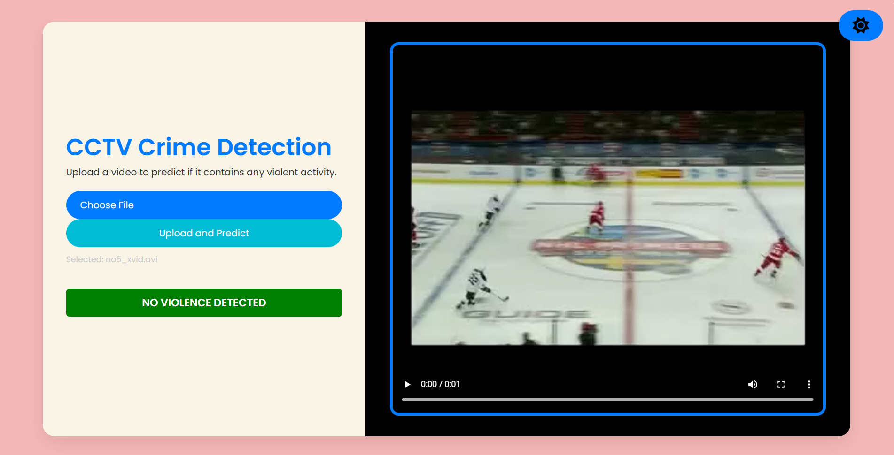

# Video-Surveillance 

A real-time AI-based video surveillance system that detects crime activities such as violence, fights, and weapon detection.

---

## 🚀 Features
✅ Detects violence, fights, and weapons(coming-soon) in real-time  
✅ Uses deep learning models for accurate detection  
✅ Supports multiple video formats(avi/mp4)  
✅ Shows alerts when a crime is detected  

---

## 🖼️ Screenshots 

### 🔹 **Detection Result**




---

## 🛠️ Installation  

### 🔹 **Prerequisites**  
Ensure you have **Miniconda** or **Anaconda** installed before proceeding.

### 🔹 **Set Up Conda Environment**  
Run the following commands in the terminal:  
```sh
# Create a new Conda environment with Python 3.10.13
conda create -n my_env python==3.10.13

# Activate the environment
conda activate my_env

# Then install the dependencies given in requirements.txt
conda install --file requirements.txt

```


## 👉To Support for .avi format also since Browser doesn't natively support .avi format:

### Install FFmpeg (If Not Installed)

### 🔹 Windows  
1. Download FFmpeg from [Gyan.dev](https://www.gyan.dev/ffmpeg/builds/).  
2. Extract the ZIP file and copy the `bin` folder path.  
3. Add it to the System Environment Variables:  
   - Search **"Edit the system environment variables"** and open it.  
   - Click **Environment Variables**.  
   - Under **System Variables**, find **Path** → Click **Edit** → Click **New**.  
   - Paste the path to the `bin` folder.  
   - Click **OK** and restart your PC.  
4. Verify installation by running the following command in Command Prompt:  
   ```sh
   ffmpeg -version
   ```

---

## **Dataset**

The dataset used in this project is sourced from Kaggle:

- **Dataset Name**: Hockey Fight Videos
- **Kaggle Link**: [Hockey Fight Videos Dataset](https://www.kaggle.com/datasets/yassershrief/hockey-fight-vidoes)
- **Description**: This dataset contains video clips of hockey fights and non-fight scenes (The videos are divided into 500 fight and 500 non-fight). It is designed for training models to classify violent and non-violent actions.

---

## **Setup and Data Preparation**

### **Step 1: Download the Dataset**
1. Visit the Kaggle dataset page: [Hockey Fight Videos Dataset](https://www.kaggle.com/datasets/yassershrief/hockey-fight-vidoes).
2. Download the dataset.

### **Step 2: Upload the Dataset to Google Drive**
1. Upload the downloaded `.zip` file (`archive.zip`) to your Google Drive.
2. Place the file in the following directory:
   ```
   /content/drive/MyDrive/Violence-Detection/
   ```

### **Step 3: Unzip the Dataset**
Run the following command in your Google Colab environment to unzip the dataset:
```python
# Unzip the dataset
!unzip /content/drive/MyDrive/Violence-Detection/archive.zip -d /content/drive/MyDrive/Violence-Detection/dataset
```
- The unzipped files will be stored in the `/content/drive/MyDrive/Violence-Detection/dataset` directory.
---

## **Directory Structure**

Here is the structure of the project directory:
```
/content/drive/MyDrive/Violence-Detection/
│
├── archive.zip                  # Zipped dataset uploaded from Kaggle
├── dataset/                     # Unzipped dataset
│   ├── data/                    
├──       fi1_xvid.avi           # Fight videos
               .                        .
               .                        .
               .                        .         
├──       no1_xvid.avi           # Non-fight videos
├── notebooks/                   # Notebooks for training and analysis
├── models/                      # Saved models after training
└── README.md                    # This file
```
---

## **Usage**

1. Clone this repository:
   ```bash
   git clone https://github.com/AdarshKhatri01/Video-Surveillance.git
   cd Video-Surveillance
   ```

2. Upload the dataset to Google Drive and unzip it as described in the **Setup and Data Preparation** section.

## **Results**
- **Accuracy**: 96%

---

## **Contributing**

If you would like to contribute to this project, feel free to fork the repository and submit a pull request. All contributions are welcome!

---
