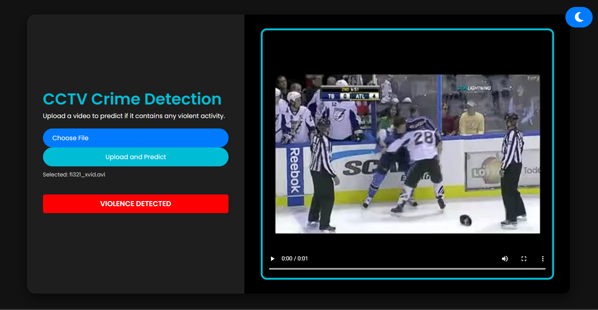

# Video-Surveillance 

A real-time AI-based video surveillance system that detects crime activities such as violence, fights, and weapon detection.

---

## 🚀 Features
✅ Detects violence, fights, and weapons(coming-soon) in real-time  
✅ Uses deep learning models for accurate detection  
✅ Supports multiple video formats(avi/mp4)  
✅ Shows alerts when a crime is detected  

---

## 🖼️ Screenshots 

### 🔹 **Detection Result**




---

## 🛠️ Installation  

### 🔹 **Prerequisites**  
Ensure you have **Miniconda** or **Anaconda** installed before proceeding.

### 🔹 **Set Up Conda Environment**  
Run the following commands in the terminal:  
```sh
# Create a new Conda environment with Python 3.10.13
conda create -n my_env python==3.10.13

# Activate the environment
conda activate my_env

# Then install the dependencies given in requirements.txt
conda install --file requirements.txt

```


## 👉To Support for .avi format also since Browser doesn't natively support .avi format:

### Install FFmpeg (If Not Installed)

### 🔹 Windows  
1. Download FFmpeg from [Gyan.dev](https://www.gyan.dev/ffmpeg/builds/).  
2. Extract the ZIP file and copy the `bin` folder path.  
3. Add it to the System Environment Variables:  
   - Search **"Edit the system environment variables"** and open it.  
   - Click **Environment Variables**.  
   - Under **System Variables**, find **Path** → Click **Edit** → Click **New**.  
   - Paste the path to the `bin` folder.  
   - Click **OK** and restart your PC.  
4. Verify installation by running the following command in Command Prompt:  
   ```sh
   ffmpeg -version
   ```